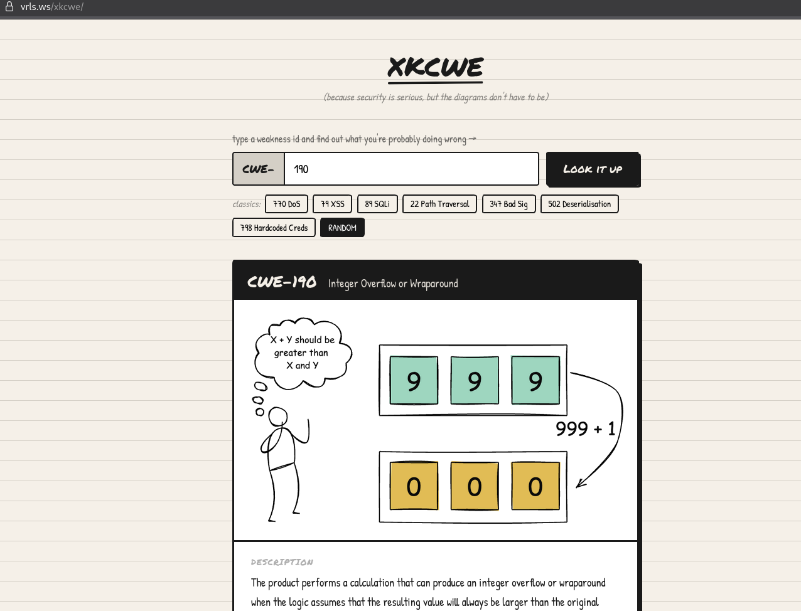

## ✏️ XKCWE: Diagram Viewer

A minimalist, serverless Single Page Application (SPA) designed to visualize MITRE’s Common Weakness Enumeration (CWE) list with a focus on official architectural diagrams.

  

### ✨ Features
* **100% Client-Side:** No backend required; runs entirely in the browser.
* **Diagram-First:** Automatically filters the dataset to the ~75 CWEs that include official visual models.
* **Zero Latency:** Instant local lookup once the CWE data is loaded.
* **Aesthetic UI:** A unique "paper-and-ink" hand-drawn style using CSS keyframes and Google Fonts.

### 🚀 Quick Start
Since this is a single-file SPA, deployment is instant:
1.  **GitHub Pages:** Upload `index.html` to a repo and enable Pages in Settings.
2.  **Netlify/Vercel:** Drag and drop the file into the dashboard.
3.  **Local:** Simply open `index.html` in any modern web browser.

### 🛠️ Technical Stack
* **Language:** Vanilla JavaScript (ES6+)
* **Styling:** CSS3 Custom Variables & Keyframes
* **Data Source:** [MITRE CWE REST-API JSON](https://github.com/CWE-CAPEC/REST-API-wg)

---
*Created for security researchers who prefer boxes and arrows over walls of text.*
